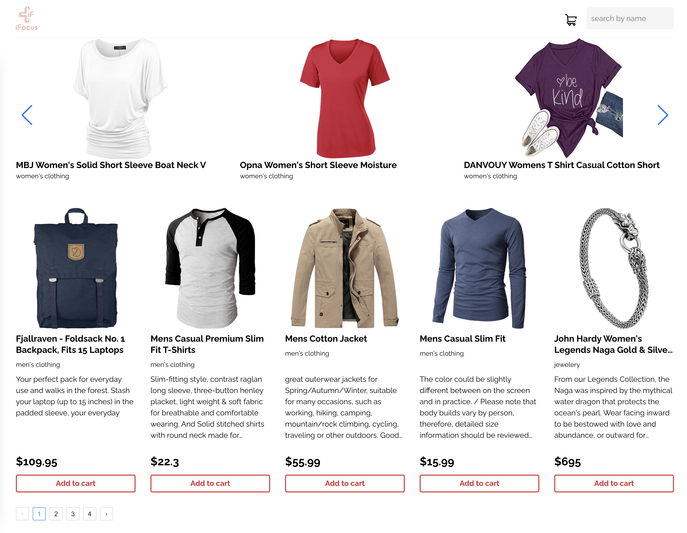

[![LinkedIn][linkedin-shield]][linkedin-url]

<!-- PROJECT LOGO -->
<br />
<p align="center">


  <h3 align="center">iFocus Test Assessment</h3>
</p>


<!-- TABLE OF CONTENTS -->
<details open="open">
  <summary>Table of Contents</summary>
  <ol>
    <li>
      <a href="#about-the-project">About The Project</a>
      <ul>
        <li><a href="#built-with">Built With</a></li>
      </ul>
    </li>
    <li>
      <a href="#getting-started">Getting Started</a>
      <ul>
        <li><a href="#prerequisites">Prerequisites</a></li>
        <li><a href="#installation">Installation</a></li>
      </ul>
    </li>
    <li><a href="#contact">Contact</a></li>
  </ol>
</details>


<!-- ABOUT THE PROJECT -->
## About The Project



The theme of the project is an e-commerce site, you are expected to write your own code without any starter template / code built from others.
For React, you are expected to use the boilerplate code from facebook/create-react-app, and for React Native, you are expected to use the boilerplate code from expo/create-react-native-app.
You can use any open source library available for your project, please respect the software licenses of the open source softwares.
In your application, you are expected to use the data from this API provider:
https://fakestoreapi.com/

Please refer to the API documentation on Fake store API for how to fetch the products data.

Project requirements (complete at least 3/7 items) 
Product list
Product details redirected from Product list
Pagination (5 items per page)
Filtering / Search
Add to cart
Remove from cart
Image carousel
Website must be mobile responsive
Reusable and clean project structure
Website must be built with React, app must be build with React Native


### Built With

* [React](https://reactjs.org/)
* [Redux](https://redux.js.org/)
* [Redux-Toolkit](https://redux-toolkit.js.org/)
* [Typescript](https://www.typescriptlang.org/)
* [Create React App](https://create-react-app.dev/)


<!-- GETTING STARTED -->
## Getting Started

### Prerequisites

* npm
  ```sh
  npm install npm@latest -g
  ```

* node.js
  ```sh
  npm install node@14.17.0
  ```
* yarn
  ```sh
  npm install yarn -g
  ```

### Installation

1. Install NPM packages
   ```sh
   yarn install
   ```
2. Run the project
   ```sh
   yarn run start
   ```
3. Build the project
   ```sh
   yarn run build
   ```
<!-- CONTACT -->
## Contact

Alexey Ivanov - alexey.ivanov.js@gmail.com


<!-- MARKDOWN LINKS & IMAGES -->
[linkedin-shield]: https://img.shields.io/badge/-LinkedIn-black.svg?style=for-the-badge&logo=linkedin&colorB=555
[linkedin-url]: https://www.linkedin.com/in/alexey-ivanov-fcsmjs
